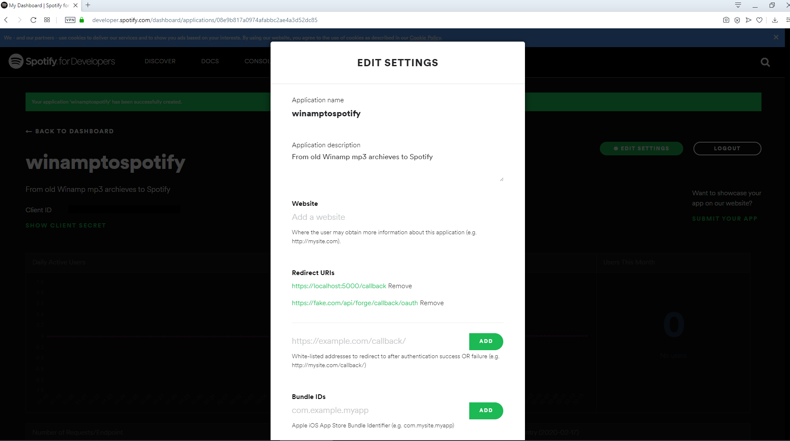

# winamptospotifyforms
Winamp Archieve to Spotify
The aim of this side project is collecting mp3 filenames from harddisk and create Spotify Playlist based on selected folder. To use this you need a Spotify Developer Account. To use the Web API, start by creating a Spotify user account (Premium or Free). To do that, simply sign up at http://www.spotify.com After creating a spotify developer account you should register an application through Dashboard.

After these 3 step your application should be created successfully.

After creating you will have ClientID and Client Secret values. After creating app from Edit Settings tab you should set Redirection URLs.

By using https://developer.spotify.com/console/get-current-user/ link you can get your UserID of Spotify User ID.

ClientID, SecretID and UserID should be placed in exampleappsettings.config

After setting these config values application is ready to run. You can reach codes from https://github.com/atahanceylan/winamptospotifyforms
I learned Access Token based authorization .Net app by https://github.com/bmsimons/dotnet-core-spotify-authentication github repo. Many thanks to Bart Simons (https://bartsimons.me/)

Here is GUI of WinampToSpotify windows form app:

First step is getting Access Token. After getting access token select folder to process.To simulate Oauth process with callback I used webbrowser code from https://adndevblog.typepad.com/cloud_and_mobile/2016/10/3-legged-oauth-on-desktop-apps-c-winform.html  post. 

Example folder I selected Black Eyed Peas

Any comments and suggestions are welcome.
